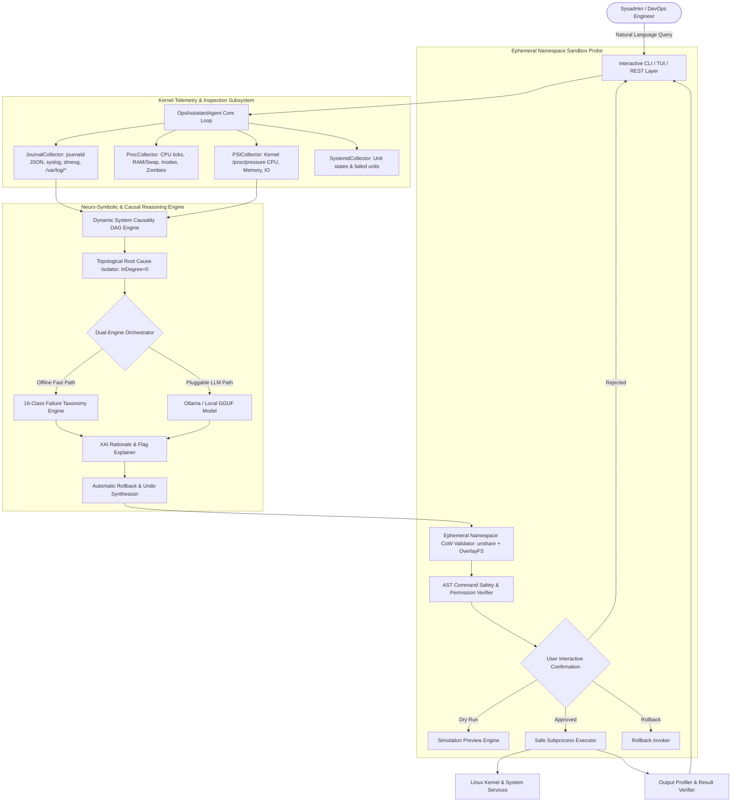

# System Architecture — AI-Powered Linux Operations Assistant (`ops-assistant`)

## 🏛️ Architecture Overview

The `ops-assistant` architecture is structured into a modular, multi-tier pipeline designed for sub-100ms latency, zero cloud token overhead, multi-vector telemetry ingestion, dynamic temporal causality graphs, and transparent Explainable AI (XAI) reasoning.

---

## 🧩 Component Deep Dive

### 1. **Interactive CLI & TUI (`ops_assistant.cli`)**
- Built with `rich` formatting and clean standard ANSI terminal fallback.
- Provides interactive REPL, `--demo` mode across representative failure vectors, automated `--benchmark` mode, and structured report export (`--export-json`, `--export-md`).

### 2. **Consolidated Telemetry Hub (`ops_assistant.collectors.hub`)**
- **`ProcCollector`**: High-performance kernel telemetry collector:
  - Samples `/proc/stat` delta ticks for CPU user/system/idle/iowait/steal percentages.
  - Parses `/proc/meminfo` for active physical RAM, buffers, and swap partition saturation.
  - Inspects `/proc/[pid]/stat` to detect defunct zombie process leaks.
  - Queries `statvfs` for physical block utilization and inode table exhaustion.
- **`PSICollector`**: Ingests `/proc/pressure/{cpu,memory,io}` 10s/60s/300s stall averages, diagnosing memory pressure and I/O starvation prior to kernel OOM invocations.
- **`JournalCollector`**: Multi-source log ingestion:
  - Streams structured JSON from `journalctl -o json -p 0..4`.
  - Captures kernel ring buffer error logs via `dmesg -T`.
  - Scrapes flat-file logs in `/var/log/{syslog,dpkg.log,auth.log,nginx/error.log}`.
- **`SystemdCollector`**: DBus unit state scanner detecting failed services (`--failed`).

### 3. **Dynamic System Causality DAG Engine (`ops_assistant.explainer.causality_dag`)**
- Ingests temporal event sequences and constructs a Directed Acyclic Graph $G = (V, E)$.
- Evaluates transition rules (e.g. `KERNEL_OOM` $\rightarrow$ `PROCESS_KILLED` $\rightarrow$ `SOCKET_CLOSED` $\rightarrow$ `UPSTREAM_502`).
- Identifies true root cause nodes with $\text{InDegree}(u) = 0$, filtering out downstream cascade noise.

### 4. **Ephemeral Namespace Sandbox Validation Probe (`ops_assistant.tools.sandbox_probe`)**
- Dry-runs candidate remediation commands in an unprivileged Linux namespace (`unshare --mount --uts --ipc --net --pid --fork`) backed by CoW OverlayFS.
- Confirms configuration syntax and execution validity before presenting proposed commands to the operator.

### 5. **Diagnostic Reasoning Agent (`ops_assistant.agent`)**
- **Dual-Engine Architecture**:
  1. *Deterministic Expert Engine*: Evaluates 16 core Linux failure taxonomy classes with sub-100ms response time and 0 cloud token cost.
  2. *Pluggable LLM Engine*: Dispatches unclassified complex queries to local models via Ollama (`llama3:8b`, `qwen2.5-coder:7b`) or cloud APIs.
- **16 Core Failure Taxonomy Classes**:
  - `PORT_CONFLICT`: Socket collision (`EADDRINUSE`).
  - `PERMISSION_DENIED`: POSIX file permission or user mismatch (`EACCES`).
  - `OOM_KILL`: Kernel Out-of-Memory killer invocation.
  - `DISK_EXHAUSTION`: 0 remaining physical disk blocks (`ENOSPC`).
  - `INODE_EXHAUSTION`: 0 remaining inode table entries.
  - `CONFIG_SYNTAX_ERROR`: Configuration file parser syntax failure.
  - `SSL_CERT_ERROR`: Expired or untrusted TLS certificate.
  - `DNS_RESOLUTION_FAILURE`: DNS query timeout or resolver failure.
  - `DPKG_LOCK_BLOCKED`: Package frontend lock held by background process.
  - `SYSTEMD_CRASH_LOOP`: Unit restart burst rate limit exceeded.
  - `DB_CONN_EXHAUSTION`: Database connection pool saturation.
  - `FIREWALL_PORT_BLOCKED`: Kernel netfilter drop / UFW block.
  - `ZOMBIE_PROCESS_ACCUMULATION`: Uncollected defunct zombie PIDs.
  - `IOWAIT_BOTTLENECK`: Kernel CPU I/O wait saturation.
  - `SELINUX_APPARMOR_DENIAL`: Mandatory Access Control security profile block.
  - `NTP_CLOCK_DRIFT`: System clock synchronization failure.

### 6. **Explainable AI (XAI) & Rollback Engine (`ops_assistant.explainer.xai`)**
- **35+ Linux Utility Flag Dictionary**: Tokenizes and decomposes command flags into plain English.
- **Automated Rollback Synthesizer**: Generates exact undo commands to revert state modifications (`systemctl start <-> stop`, `ufw allow <-> delete allow`).

### 7. **Safety Validator & Execution Sandbox (`ops_assistant.tools.*`)**
- **Risk Classification**:
  - `READ_ONLY` (Risk 0.05)
  - `MODIFYING` (Risk 0.35)
  - `HIGH_RISK` (Risk 0.70)
  - `DESTRUCTIVE` (Risk 1.00)
- Blocks catastrophic patterns (`rm -rf /`, fork bombs, `/etc/passwd` overwrites, raw block device writes).
