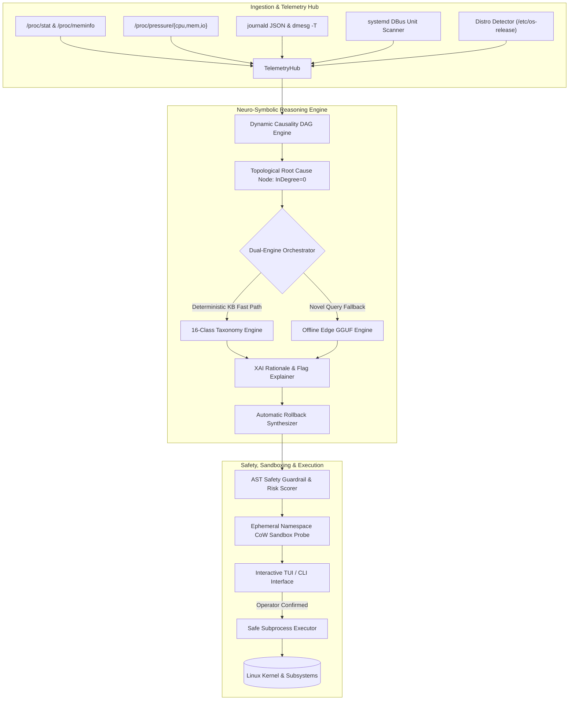

# Technical Architecture Specification — `ops-assistant`

> **Document Version**: 2.0.0  
> **Target Audience**: System Architects, Kernel Engineers, Hackathon Evaluators  
> **Status**: Production Reference Specification  

---

## 1. System Mission & Operational Paradigm

`ops-assistant` is an autonomous, explainable operations assistant engineered for Linux server and edge ecosystems. Its core mission is to eliminate multi-hour sysadmin incident triaging by providing **sub-50ms deterministic root cause analysis**, **empirical namespace sandbox validation**, and **transparent Explainable AI (XAI) deconstructions** of candidate remediations.

### Core Architectural Axioms
1. **Air-Gapped First**: Every core diagnostic path must execute locally on bare-metal without outbound network calls, cloud tokens, or API credentials.
2. **Causal Over Correlational**: Root cause isolation must be governed by Directed Acyclic Graphs (DAG) with topological in-degree minimization ($\text{InDegree}=0$), suppressing symptom cascade noise.
3. **Zero Blind Execution**: Every proposed remediation command must undergo AST safety scanning and CoW ephemeral namespace sandbox dry-run verification before operator presentation.
4. **Distro-Agnostic Adaptation**: Operating system commands must automatically adapt to target distributions (Debian/Ubuntu, RHEL/Rocky/Fedora, Arch Linux, Alpine Linux, openSUSE).

---

## 2. High-Level Architecture & Component Interaction



---

## 3. Subsystem Specifications

### 3.1 Consolidated Telemetry Hub (`ops_assistant.collectors.hub`)
The Telemetry Hub provides unified, multi-vector ingestion of Linux kernel state and user-space service logs.

| Collector Subsystem | Source Interface | Telemetry Ingested | Latency Target |
|---|---|---|---|
| `ProcCollector` | `/proc/stat`, `/proc/meminfo`, `/proc/[pid]/stat`, `statvfs` | CPU delta ticks (user, sys, iowait), RAM/Swap buffers, zombie PID counts, disk/inode utilization | $<1.5\text{ ms}$ |
| `PSICollector` | `/proc/pressure/{cpu,memory,io}` | 10s, 60s, 300s stall averages; full vs. some stall metrics | $<0.8\text{ ms}$ |
| `JournalCollector` | `journalctl -o json`, `dmesg -T`, `/var/log/*` | Prioritized structured system errors (`-p 0..4`), kernel panics, OOM killer traces | $<25\text{ ms}$ |
| `SystemdCollector` | `systemctl --failed`, DBus | Active unit crash loops, failed restart bursts, state masks | $<8\text{ ms}$ |
| `DistroDetector` | `/etc/os-release`, `/etc/issue` | Distro family, version, package manager, service manager, firewall | $<0.5\text{ ms}$ |

---

### 3.2 Dynamic Causality DAG Engine (`ops_assistant.explainer.causality_dag`)
Traditional log analyzers dump flat logs. `ops-assistant` constructs a directed causal graph $G = (V, E)$, where vertices $V$ represent observed anomalous events and directed edges $E = \{(u, v)\}$ represent causal dependencies ($u \text{ caused } v$).

#### Mathematical Formulation
1. **Event Extraction**: From log traces $L$ and metric alerts $M$, extract event set $V = \{e_1, e_2, \dots, e_n\}$.
2. **Temporal & Dependency Linking**: Add directed edge $(e_i, e_j)$ if $t(e_i) \le t(e_j)$ and rule $\mathcal{R}(e_i \rightarrow e_j)$ is satisfied.
3. **Root Cause Isolation**:
   $$\text{RootCause} = \{ u \in V \mid \text{InDegree}(u) = 0 \land \text{OutDegree}(u) > 0 \}$$
4. **Mermaid Rendering**: Automatically renders visualization string for terminal and markdown reporting.

---

### 3.3 Ephemeral Namespace Sandbox Probe (`ops_assistant.tools.sandbox_probe`)
Before presenting remediation commands to the operator, `ops-assistant` dry-runs candidate commands in an isolated Linux User + Mount namespace.

```
Host Filesystem (Read-Only Lowerdir)
                 ▲
                 │ (CoW OverlayFS)
[ Ephemeral Namespace Sandbox: unshare(CLONE_NEWUSER | CLONE_NEWNS | CLONE_NEWNET) ]
                 │
           Command Dry-Run
                 │
           Exit Code & Stderr Verification
```

- **Execution Flags**: `unshare --mount --uts --ipc --net --pid --fork`
- **Fallback**: AST syntax validation and mock state simulation on unprivileged or containerized kernels lacking unshare permissions.

---

### 3.4 AST Safety Guardrails & 4-Tier Risk Matrix (`ops_assistant.tools.safety`)
Every command generated is evaluated against a 4-tier risk classification engine:

| Safety Tier | Risk Score | Evaluation Criteria | Examples |
|---|---|---|---|
| `READ_ONLY` | $0.00 - 0.10$ | Zero side-effects; purely inspects system state | `ss -tulpn`, `df -h`, `systemctl status` |
| `MODIFYING` | $0.20 - 0.50$ | Modifies service runtime or package state; fully reversible | `systemctl restart nginx`, `ufw allow 80/tcp` |
| `HIGH_RISK` | $0.60 - 0.85$ | Modifies kernel sysctl, disk layouts, firewall rulesets | `sysctl -w vm.drop_caches=3`, `iptables -F` |
| `DESTRUCTIVE` | $1.00$ | Permanent data loss, catastrophic deletion, shellcode | `rm -rf /`, `:(){ :\|:& };:`, `mkfs.ext4 /dev/sda` |

> [!CAUTION]
> Commands classified with risk score $1.00$ are **permanently blocked by the safety gate** and cannot be executed by the tool under any condition.

---

## 4. Distro Knowledge Engine (`ops_assistant.db.distro_db`)
The system contains an embedded SQLite database mapping commands, lock signatures, and error patterns across all major Linux distributions:

```
┌────────────────────────────────────────────────────────┐
│               SQLite Distro Knowledge Base             │
├────────────────────────────────────────────────────────┤
│ • distro_profiles (id, family, pkg_mgr, svc_mgr, fw)   │
│ • distro_commands (distro_id, category, cmd_template)  │
│ • distro_locks (distro_id, lock_path, colliding_proc)  │
│ • distro_error_signatures (pattern, category, action)  │
└────────────────────────────────────────────────────────┘
```
This guarantees that an Ubuntu system receives `apt-get` / `systemctl` / `ufw` commands, an Arch system receives `pacman` / `systemctl` / `iptables`, an Alpine system receives `apk` / `rc-service` / `nftables`, and a RHEL system receives `dnf` / `systemctl` / `firewalld`.
